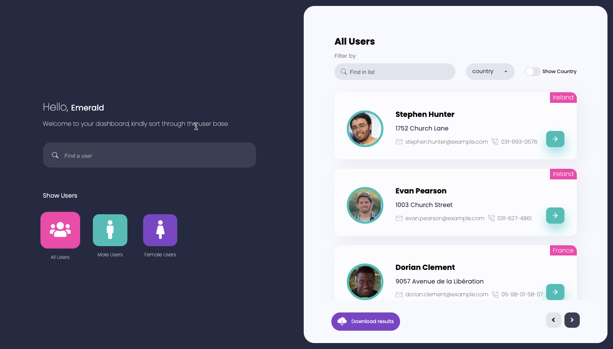

# RandUserGen
### App homepage


[Link to live url](https://random-people.netlify.app/)

## Installation
```
npm install
npm run start
```

[](https://app.circleci.com/pipelines/github/dexkode4/RandUserGen)